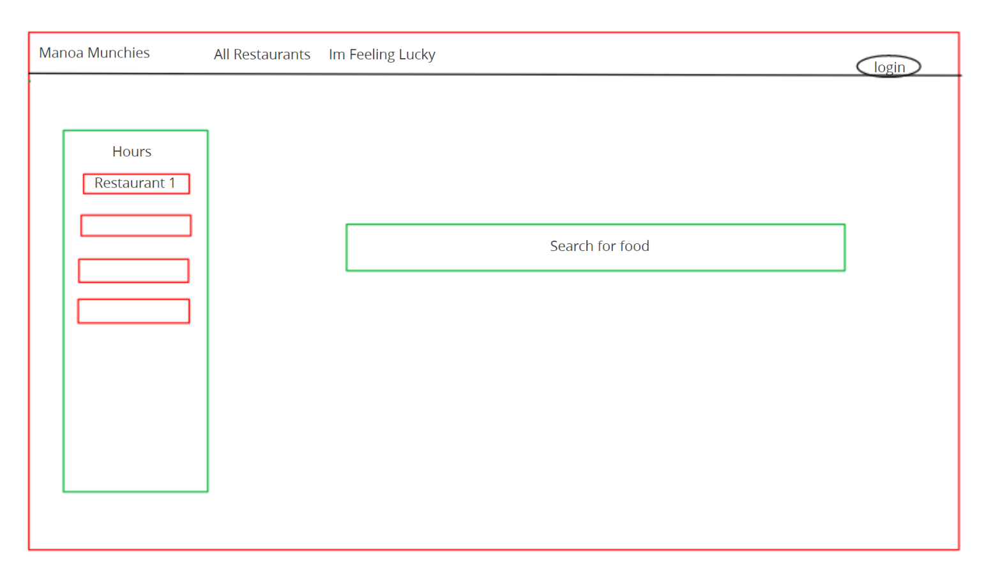
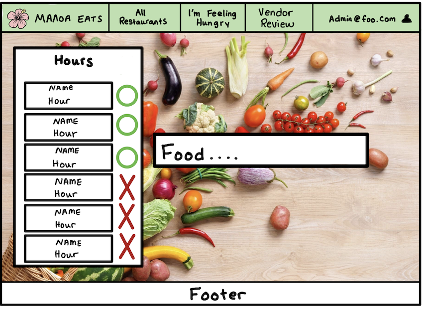
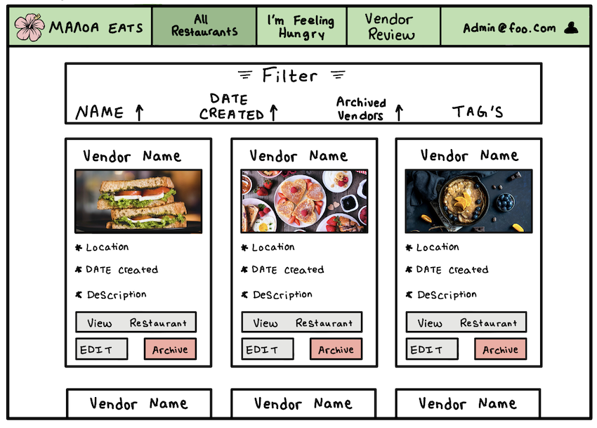
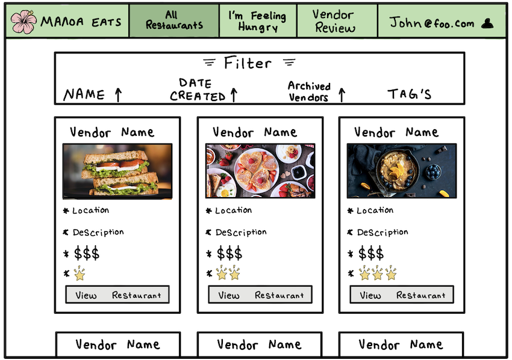
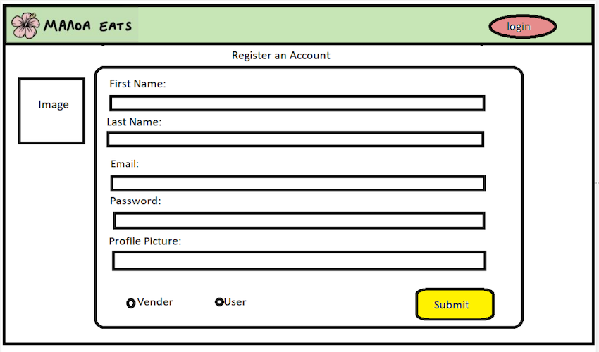
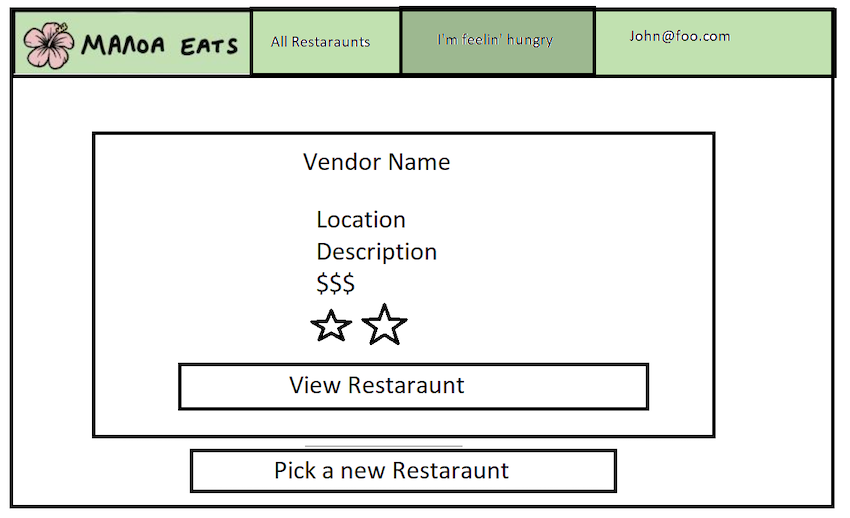
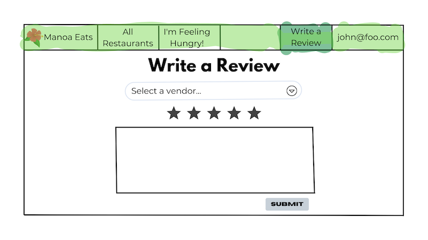
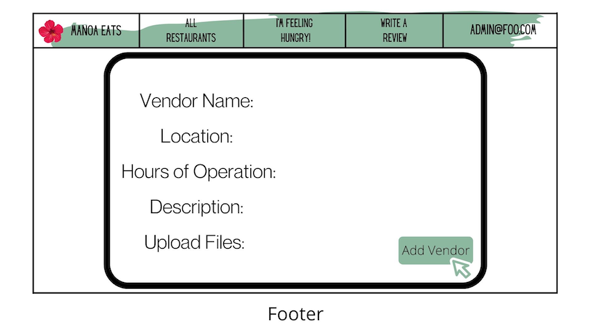

# Manoa Eats

## Table of contents

* [Team Contract](#team-contract)
* [Team](#team)
* [Github](#github)
* [Overview](#overview)
* [Developer Guide](#developer-guide)
* [Development History](#development-history)
* [Deployment](#deployment)
* [Mockups](#mockups)

# Team Contract
[Team Contract](https://docs.google.com/document/d/1-v9pqiJ7Q1Jij45WQcrJkHYzmSRQN-saOC0DPg8Gzvk/edit?usp=sharing)

## Team
Manoa Eats is designed, implemented, and maintained by:
[Tyler Baguio](https://tylerb8.github.io), [Kristi Chinen](https://kristihchinen.github.io), [Jeraldine Milla](https://itsjerie.github.io), [Nenye Ndili](https://nenyehub.github.io), [Gavin Peng](https://devgav.github.io)

# Github
[Github](https://github.com/manoa-eats/manoa-eats.github.io)

# Overview
### The Problem
Not many students know about all of our fine dish eateries on the UH Manoa campus. In addition, some students who want to try new restaurants may not get a chance to because they may have time conflicts with their schedule leaving some restaurants having either too many students in line or not enough students. 

### The Solution
Manoa Eats will allow hardworking students to nourish their brains with UH’s nutritious food located all around the campus. Students will be able to upload their schedules along with their course locations, and our website will estimate the best restaurant locations to stop at on their path to their next class.

# Developer Guide 
### Installation

- First, [install Meteor](https://www.meteor.com/developers/install)

- Second, download a copy of [Manoa Eats](https://github.com/manoa-eats/manoa-eats.github.io) and clone it to your laptop

- Third, cd into the app/directory and install the libraries with 

`$ meteor npm install`

- Fourth, run the system with 

`$ meteor npm run start`

- If all goes well it will appear at [http://localhost:3000/](http://localhost:3000/)

# Development History
## Final project: Milestone 1

- [Milestone 1](https://github.com/manoa-eats/manoa-eats.github.io/projects/1)

## Final Project: Milestone 2

# Deployment

[Digital Ocean](http://143.110.226.189/#/)

# Mockups
### Mockup Landing Page
This landing page is the first mockup that was created during our first group meeting. It is a rough sketch of what we were thinking we wanted our landing page to look like. We wanted to keep it very simple and not too cluttered allowing people to visit our other tabs that we are envisioning our site will have. 

After that meeting we then wanted to make a better mockup to have a cleaner look and allow for our landing page to match the theme we are envisioning. The X's and O's on the left side of the page will indicate if a restaurant is opened or closed. In the middle of the page there is a search bar where you can look up a specific food and it will appear where it is being served at. 

### Admin Page
In addition to a standard user there is an admin user. They are able to edit the All Restaurants tab and archive or edit the different vendors, along with the other features that are available for a regular user. 

### All Restaurants Tab
With the All Restaurants tab users are able to see the restaurants and their description, reviews, price range, and location. Users are also able to filter their searches by either their name, date the restaurant was added to the website, and any specific tags. 

### User Page
Our user page is where people are able to register and create an account. It is a very simple form that asks for your name, email, password, and if you want to add in a profile picture. The user will also be able to indicate if they will be wanting a user profile or a vendor profile. 

### I'm Feelin' Lucky Tab
When a user access this tab they will be given a random restaurant with its details. If the user is not satisfied with their random choice they are always able to have another restaurant chosen at random.

### Write a Review
Users are able to leave reviews on the different restaurants they visited so other users know what to except when going, if they have any menu recommendations, etc. 

### Adding a Vendor
After creating a vendor profile they will be able to add their restaurant to our life. They will need to add in their restaurant name, location, hours of operation, a short description about their restaurant, and they are able to upload any files (i.e. menus). 

